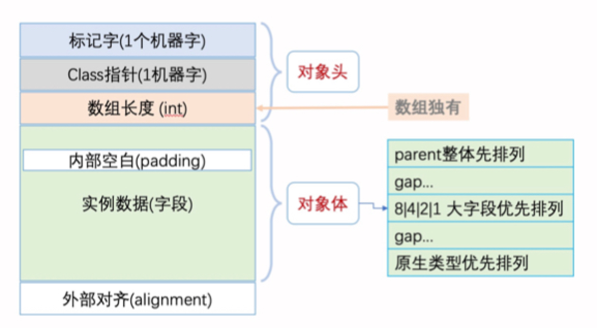

# 学习笔记

## GC日志解读与分析

- 打印GC详细信息
`java -XX:+PrintGCDetails GCLogAnalysis`

- 打印GC详细信息、时间戳，输出到文件
`java -Xloggc:gc.demo.log -XX:+PrintGCDetails -XX:+PrintGCDateStamps GCLogAnalysis`

java8 并行GC 默认堆内存：物理内存1/4

- 模拟OOM
`java -Xmx128m -XX:+PrintGCDetails GCLogAnalysis`

`java -Xmx256m -XX:+PrintGCDetails GCLogAnalysis`

### 串行GC
`java -XX:+UseSerialGC -Xms512m -Xmx512m -XX:+PrintGCDetails -XX:+PrintGCDateStamps GCLogAnalysis`
`java -XX:+UseSerialGC -Xms512m -Xmx512m -Xloggc:gc.demo.log -XX:+PrintGCDetails -XX:+PrintGCDateStamps GCLogAnalysis`

### 并行GC
`java -XX:+UseParallelGC -Xms512m -Xmx512m -XX:+PrintGCDetails GCLogAnalysis`
`java -XX:+UseParallelGC -Xms512m -Xmx512m -Xloggc:gc.demo.log -XX:+PrintGCDetails -XX:+PrintGCDateStamps GCLogAnalysis`

### CMS
`java -XX:+UseConcMarkSweepGC -Xms512m -Xmx512m -XX:+PrintGCDetails GCLogAnalysis`
`java -XX:+UseConcMarkSweepGC -Xms512m -Xmx512m -Xloggc:gc.demo.log -XX:+PrintGCDetails -XX:+PrintGCDateStamps GCLogAnalysis`

- 执行阶段
  - 阶段 1:Initial Mark(初始标记)
  - 阶段 2:Concurrent Mark(并发标记)
  - 阶段 3:Concurrent Preclean(并发预清理)
  - 阶段 4: Final Remark(最终标记)
  - 阶段 5: Concurrent Sweep(并发清除) 
  - 阶段 6: Concurrent Reset(并发重置)

### G1 GC
`java -XX:+UseG1GC -Xms512m -Xmx512m -XX:+PrintGC GCLogAnalysis`
`java -XX:+UseG1GC -Xms512m -Xmx512m -XX:+PrintGCDetails GCLogAnalysis`
`java -XX:+UseG1GC -Xms512m -Xmx512m -Xloggc:gc.demo.log -XX:+PrintGCDetails -XX:+PrintGCDateStamps GCLogAnalysis`

- 执行阶段
  - Evacuation Pause: young(纯年轻代模式转移暂停)
  - Concurrent Marking(并发标记)
  - 阶段 1: Initial Mark(初始标记)
  - 阶段 2: Root Region Scan(Root区扫描)
  - 阶段 3: Concurrent Mark(并发标记)
  - 阶段 4: Remark(再次标记)
  - 阶段 5: Cleanup(清理)
  - Evacuation Pause (mixed)(转移暂停: 混合模式)
  - Full GC (Allocation Failure)

### GC日志分析工具

- GCEasy:[https://gceasy.io/](https://gceasy.io/)
- GCViewer

## JVM线程堆栈数据分析

### JVM内部线程主要
- VM 线程:单例的 VMThread 对象，负责执行 VM 操作， 下文将对此进行讨论;
- 定时任务线程:单例的 WatcherThread 对象， 模拟在 VM 中执行定时操作的计时器中断;
- GC 线程:垃圾收集器中，用于支持并行和并发垃圾回收 的线程;
- 编译器线程: 将字节码编译为本地机器代码;
- 信号分发线程:等待进程指示的信号，并将其分配给Java 级别的信号处理方法

### JVM线程分析工具

- fastthread:[https://fastthread.io/](https://fastthread.io/)

## 内存分析与相关工具

- 可以使用 Instrumentation.getObjectSize() 方法来估算一个对象占用的内存空间。
- JOL (Java Object Layout) 可以用来查看对象内存布局

### 对象头和对象引用

- 64位JVM中，对象头占据的空间是 12- byte(=96bit=64+32)，但是以8字节对齐，所以一个空类的实例至少占用16字节。
- 32位JVM中，对象头占8个字节，以4的倍数对 齐(32=4*8)

new 出来很多简单对象，甚至是`new Object()`，都会占用不少内容
通常在32位JVM，以及内存小于`-Xmx32G`的64位JVM上(默认开启指针压缩)，一个引用占的内存默 认是4个字节。
因此，64位 JVM 一般需要多消耗堆内存。

## JVM 问题分析调优经验

### 高分配速率(High Allocation Rate)

分配速率(Allocation rate)表示单位时间内分配的内存量。通常 使用 MB/sec 作为单位。上一次垃圾收集之后，与下一次 GC 开 始之前的年轻代使用量，两者的差值除以时间,就是分配速率。

分配速率过高就会严重影响程序的性能，在 JVM 中可能会导致巨 大的 GC 开销。

- 正常系统:分配速率较低 ~ 回收速率 -> 健康
- 内存泄漏:分配速率 持续大于 回收速率 -> OOM
- 性能劣化:分配速率较高 ~ 回收速率 -> 亚健康

### 过早提升(Premature Promotion)

提升速率(promotion rate)用于衡量单位时间内从年轻代提 升到老年代的数据量。一般使用 MB/sec 作为单位, 和分配速率 类似。

JVM 会将长时间存活的对象从年轻代提升到老年代。根据分代假 设，可能存在一种情况，老年代中不仅有存活时间长的对象,， 也可能有存活时间短的对象。这就是过早提升:对象存活时间还 不够长的时候就被提升到了老年代。

major GC 不是为频繁回收而设计的，但 major GC 现在也要清 理这些生命短暂的对象，就会导致 GC 暂停时间过长。这会严重 影响系统的吞吐量。