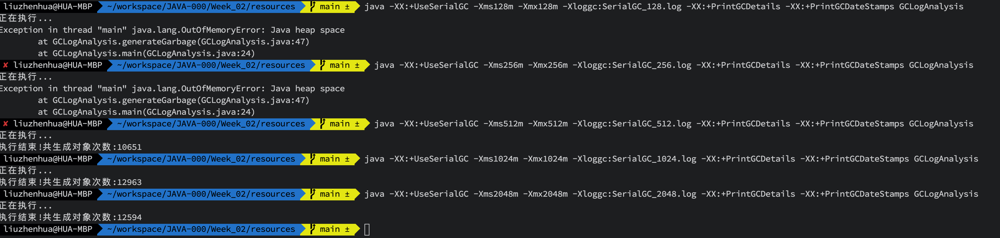
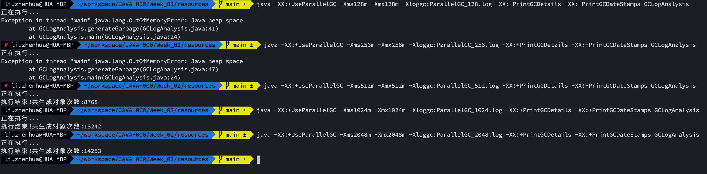
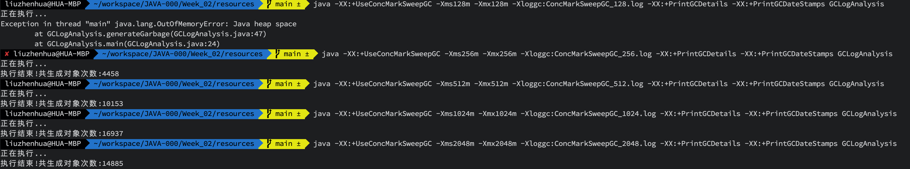
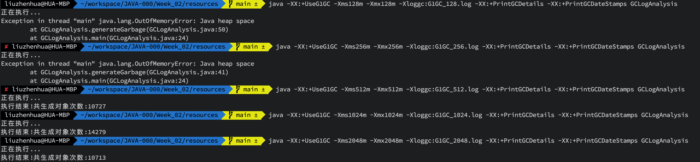

# 作业一

- 使用 GCLogAnalysis.java 自己演练一遍串行/并行/CMS/G1的案例。
- 使用压测工具(wrk或sb)，演练gateway-server-0.0.1-SNAPSHOT.jar 示例

## 串行/并行/CMS/G1 演练

### GCLogAnalysis 串行/并行/CMS/G1 演练

#### 串行GC

```shell
java -XX:+UseSerialGC -Xms128m -Xmx128m -Xloggc:SerialGC_128.log -XX:+PrintGCDetails -XX:+PrintGCDateStamps GCLogAnalysis
java -XX:+UseSerialGC -Xms256m -Xmx256m -Xloggc:SerialGC_256.log -XX:+PrintGCDetails -XX:+PrintGCDateStamps GCLogAnalysis
java -XX:+UseSerialGC -Xms512m -Xmx512m -Xloggc:SerialGC_512.log -XX:+PrintGCDetails -XX:+PrintGCDateStamps GCLogAnalysis
java -XX:+UseSerialGC -Xms1024m -Xmx1024m -Xloggc:SerialGC_1024.log -XX:+PrintGCDetails -XX:+PrintGCDateStamps GCLogAnalysis
java -XX:+UseSerialGC -Xms2048m -Xmx2048m -Xloggc:SerialGC_2048.log -XX:+PrintGCDetails -XX:+PrintGCDateStamps GCLogAnalysis
```


#### 并行GC

```shell
java -XX:+UseParallelGC -Xms128m -Xmx128m -Xloggc:ParallelGC_128.log -XX:+PrintGCDetails -XX:+PrintGCDateStamps GCLogAnalysis
java -XX:+UseParallelGC -Xms256m -Xmx256m -Xloggc:ParallelGC_256.log -XX:+PrintGCDetails -XX:+PrintGCDateStamps GCLogAnalysis
java -XX:+UseParallelGC -Xms512m -Xmx512m -Xloggc:ParallelGC_512.log -XX:+PrintGCDetails -XX:+PrintGCDateStamps GCLogAnalysis
java -XX:+UseParallelGC -Xms1024m -Xmx1024m -Xloggc:ParallelGC_1024.log -XX:+PrintGCDetails -XX:+PrintGCDateStamps GCLogAnalysis
java -XX:+UseParallelGC -Xms2048m -Xmx2048m -Xloggc:ParallelGC_2048.log -XX:+PrintGCDetails -XX:+PrintGCDateStamps GCLogAnalysis
```



#### CMS CC

```shell
java -XX:+UseConcMarkSweepGC -Xms128m -Xmx128m -Xloggc:ConcMarkSweepGC_128.log -XX:+PrintGCDetails -XX:+PrintGCDateStamps GCLogAnalysis
java -XX:+UseConcMarkSweepGC -Xms256m -Xmx256m -Xloggc:ConcMarkSweepGC_256.log -XX:+PrintGCDetails -XX:+PrintGCDateStamps GCLogAnalysis
java -XX:+UseConcMarkSweepGC -Xms512m -Xmx512m -Xloggc:ConcMarkSweepGC_512.log -XX:+PrintGCDetails -XX:+PrintGCDateStamps GCLogAnalysis
java -XX:+UseConcMarkSweepGC -Xms1024m -Xmx1024m -Xloggc:ConcMarkSweepGC_1024.log -XX:+PrintGCDetails -XX:+PrintGCDateStamps GCLogAnalysis
java -XX:+UseConcMarkSweepGC -Xms2048m -Xmx2048m -Xloggc:ConcMarkSweepGC_2048.log -XX:+PrintGCDetails -XX:+PrintGCDateStamps GCLogAnalysis
```



#### G1 GC

```shell
java -XX:+UseG1GC -Xms128m -Xmx128m -Xloggc:G1GC_128.log -XX:+PrintGCDetails -XX:+PrintGCDateStamps GCLogAnalysis
java -XX:+UseG1GC -Xms256m -Xmx256m -Xloggc:G1GC_256.log -XX:+PrintGCDetails -XX:+PrintGCDateStamps GCLogAnalysis
java -XX:+UseG1GC -Xms512m -Xmx512m -Xloggc:G1GC_512.log -XX:+PrintGCDetails -XX:+PrintGCDateStamps GCLogAnalysis
java -XX:+UseG1GC -Xms1024m -Xmx1024m -Xloggc:G1GC_1024.log -XX:+PrintGCDetails -XX:+PrintGCDateStamps GCLogAnalysis
java -XX:+UseG1GC -Xms2048m -Xmx2048m -Xloggc:G1GC_2048.log -XX:+PrintGCDetails -XX:+PrintGCDateStamps GCLogAnalysis
```



### gateway-server-0.0.1-SNAPSHOT.jar 串行/并行/CMS/G1 演练

#### 串行GC

- 堆大小：512M

`java -jar -XX:+UseSerialGC -Xms512m -Xmx512m -Xloggc:SerialGC_gateway_512.log -XX:+PrintGCDetails -XX:+PrintGCDateStamps gateway-server-0.0.1-SNAPSHOT.jar`

压测结果：
```
wrk -c40 -d30s http://localhost:8088/api/hello

Running 30s test @ http://localhost:8088/api/hello
  2 threads and 40 connections
  Thread Stats   Avg      Stdev     Max   +/- Stdev
    Latency    20.06ms   61.94ms 439.27ms   90.95%
    Req/Sec    29.47k     8.13k   49.92k    87.68%
  1632593 requests in 30.08s, 194.92MB read
Requests/sec:  54279.95
Transfer/sec:      6.48MB
```

- 堆大小：2G

`java -jar -XX:+UseSerialGC -Xms2g -Xmx2g -Xloggc:SerialGC_gateway_2g.log -XX:+PrintGCDetails -XX:+PrintGCDateStamps gateway-server-0.0.1-SNAPSHOT.jar`

压测结果：
```
wrk -c40 -d30s http://localhost:8088/api/hello

Running 30s test @ http://localhost:8088/api/hello
  2 threads and 40 connections
  Thread Stats   Avg      Stdev     Max   +/- Stdev
    Latency    10.70ms   60.14ms 705.06ms   97.13%
    Req/Sec    27.17k     9.45k   40.84k    79.04%
  1581590 requests in 30.07s, 188.83MB read
Requests/sec:  52591.56
Transfer/sec:      6.28MB
```

#### 并行GC

- 堆大小：512M

`java -jar -XX:+UseParallelGC -Xms512m -Xmx512m -Xloggc:ParallelGC_gateway_512.log -XX:+PrintGCDetails -XX:+PrintGCDateStamps gateway-server-0.0.1-SNAPSHOT.jar`

压测结果：
```
wrk -c40 -d30s http://localhost:8088/api/hello

Running 30s test @ http://localhost:8088/api/hello
  2 threads and 40 connections
  Thread Stats   Avg      Stdev     Max   +/- Stdev
    Latency    10.71ms   65.46ms 751.74ms   97.52%
    Req/Sec    28.35k     8.67k   37.08k    81.72%
  1638346 requests in 30.36s, 195.60MB read
Requests/sec:  53965.89
Transfer/sec:      6.44MB
```

- 堆大小：2G

`java -jar -XX:+UseParallelGC -Xms2g -Xmx2g -Xloggc:ParallelGC_gateway_2g.log -XX:+PrintGCDetails -XX:+PrintGCDateStamps gateway-server-0.0.1-SNAPSHOT.jar`

压测结果：
```
wrk -c40 -d30s http://localhost:8088/api/hello

Running 30s test @ http://localhost:8088/api/hello
  2 threads and 40 connections
  Thread Stats   Avg      Stdev     Max   +/- Stdev
    Latency     9.85ms   53.75ms 630.56ms   96.66%
    Req/Sec    27.77k     8.79k   38.01k    77.74%
  1616879 requests in 30.04s, 193.04MB read
Requests/sec:  53827.33
Transfer/sec:      6.43MB
```


### CMS CC

- 堆大小：512M

`java -jar -XX:+UseConcMarkSweepGC -Xms512m -Xms512m -Xloggc:ConcMarkSweepGC_gateway_512.log -XX:+PrintGCDetails -XX:+PrintGCDateStamps gateway-server-0.0.1-SNAPSHOT.jar`

压测结果：
```
wrk -c40 -d30s http://localhost:8088/api/hello

Running 30s test @ http://localhost:8088/api/hello
  2 threads and 40 connections
  Thread Stats   Avg      Stdev     Max   +/- Stdev
    Latency     1.87ms    7.90ms 162.05ms   97.48%
    Req/Sec    23.27k     7.04k   33.29k    71.07%
  1385584 requests in 30.03s, 165.43MB read
Requests/sec:  46146.80
Transfer/sec:      5.51MB
```

- 堆大小：2G

`java -jar -XX:+UseConcMarkSweepGC -Xms2g -Xms2g -Xloggc:ConcMarkSweepGC_gateway_2g.log -XX:+PrintGCDetails -XX:+PrintGCDateStamps gateway-server-0.0.1-SNAPSHOT.jar`

压测结果：
```
wrk -c40 -d30s http://localhost:8088/api/hello
Running 30s test @ http://localhost:8088/api/hello
  2 threads and 40 connections
  Thread Stats   Avg      Stdev     Max   +/- Stdev
    Latency     2.73ms   10.72ms 190.83ms   95.80%
    Req/Sec    23.47k     8.29k   36.17k    73.41%
  1396826 requests in 30.01s, 166.77MB read
Requests/sec:  46537.92
Transfer/sec:      5.56MB
```

### G1 GC

- 堆大小：512M

`java -jar -XX:+UseG1GC -Xms512m -Xms512m -Xloggc:G1GC_gateway_512.log -XX:+PrintGCDetails -XX:+PrintGCDateStamps gateway-server-0.0.1-SNAPSHOT.jar`

压测结果：
```
wrk -c40 -d30s http://localhost:8088/api/hello

Running 30s test @ http://localhost:8088/api/hello
  2 threads and 40 connections
  Thread Stats   Avg      Stdev     Max   +/- Stdev
    Latency     5.70ms   31.18ms 447.50ms   96.75%
    Req/Sec    24.95k     9.14k   37.00k    80.68%
  1469146 requests in 30.03s, 175.40MB read
Requests/sec:  48917.82
Transfer/sec:      5.84MB
```

- 堆大小：2G

`java -jar -XX:+UseG1GC -Xms2g -Xms2g -Xloggc:G1GC_gateway_2g.log -XX:+PrintGCDetails -XX:+PrintGCDateStamps gateway-server-0.0.1-SNAPSHOT.jar`

压测结果：
```
wrk -c40 -d30s http://localhost:8088/api/hello

Running 30s test @ http://localhost:8088/api/hello
  2 threads and 40 connections
  Thread Stats   Avg      Stdev     Max   +/- Stdev
    Latency     2.38ms   11.42ms 190.00ms   97.08%
    Req/Sec    25.43k     8.07k   44.67k    74.87%
  1512487 requests in 30.06s, 180.58MB read
Requests/sec:  50314.70
Transfer/sec:      6.01MB
```