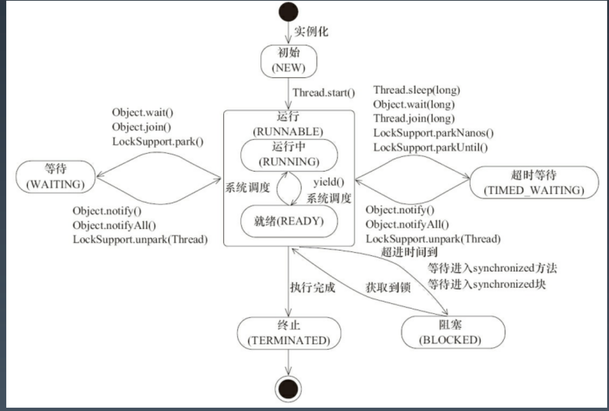
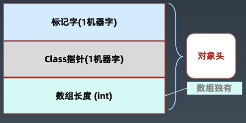
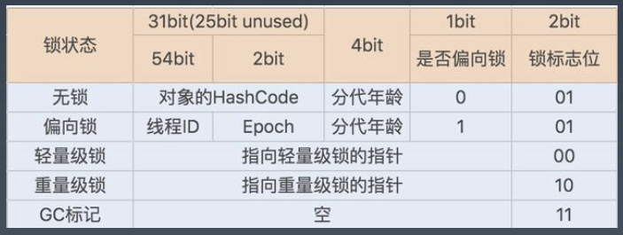

# 学习笔记

## Java 并发编程

### 线程状态

### Thread类

|重要属性/方法|说明|
|---|---|
|volatile String name;|线程名称-诊断分析使用|
|boolean daemon = false;|后台守护线程标志-决定JVM优雅关闭|
|Runnable target;|任务(只能通过构造函数传入)|
|public synchronized void start()|[协作]启动新线程并自动执行|
|void join();|[协作]等待某个线程执行完毕(来汇合)|
|public static native Thread currentThread();|获取当前线程对象|
|public static native void sleep(long millis);|线程睡眠并让出CPU时间片|
|public final void wait()|放弃锁+等待Oms+尝试获取锁|
|public final native void wait(long timeout)|放弃锁+wait+到时间自动唤醒/中途唤醒(唤醒之后需要自动获取锁)|
|public final void wait(long timeout, int nanos)|放弃锁+wait+到时间自动唤醒/中途唤醒(精度：nanos>0则timeout++)|
|public final native void notify();|发送信号通知1个等待线程|
|public final native void notifyAll();|发送信号通知所有等待线程|

### Thread的状态改变操作

1. Thread.sleep(long millis)，一定是当前线程调用此方法，当前线程进入 TIMED_WAITING 状态，但不释放对象锁，
millis 后线程自动苏醒进入就绪状态。作用:给其它线程执行机会的最佳方式。
2. Thread.yield()，一定是当前线程调用此方法，当前线程放弃获取的 CPU 时间片，但不释放锁资源，由运行状态变为就 绪状态，让 OS 再次选择线程。作用:让相同优先级的线程轮流执行，但并不保证一定会轮流执行。实际中无法保证 yield() 达到让步目的，因为让步的线程还有可能被线程调度程序再次选中。Thread.yield() 不会导致阻塞。该方法与 sleep() 类似，只是不能由用户指定暂停多长时间。
3. t.join()/t.join(long millis)，当前线程里调用其它线程 t 的 join 方法，当前线程进入WAITING/TIMED_WAITING 状态， 当前线程不会释放已经持有的对象锁。线程t执行完毕或者 millis 时间到，当前线程进入就绪状态。
4. obj.wait()，当前线程调用对象的 wait() 方法，当前线程释放对象锁，进入等待队列。依靠 notify()/notifyAll() 唤醒或 者 wait(long timeout) timeout 时间到自动唤醒。
5. obj.notify() 唤醒在此对象监视器上等待的单个线程，选择是任意性的。notifyAll() 唤醒在此对象监视器上等待的所有线程。

### Thread的中断与异常处理

1. 线程内部自己处理异常，不溢出到外层。
2. 如果线程被 Object.wait, Thread.join 和 Thread.sleep 三种方法之一阻塞，此时调用该线程 的interrupt() 方法，那么该线程将抛出一个 InterruptedException 中断异常(该线程必须事 先预备好处理此异常)，从而提早地终结被阻塞状态。如果线程没有被阻塞，这时调用 interrupt() 将不起作用，直到执行到 wait(),sleep(),join() 时,才马上会抛出 InterruptedException。
3. 如果是计算密集型的操作怎么办? 分段处理，每个片段检查一下状态，是不是要终止

### 多线程执行会遇到的问题

### 并发相关的性质

- 原子性
- 可见性
  - 对于可见性，Java提供了volatile关键字来保证可见性
  - 当一个共享变量被 volatile 修饰时，它会保证修改的值会立即被更新到主存，当有其他
线程需要读取时，它会去内存中读取新值。
  - 通过 synchronized 和 Lock 也能够保证可见性，synchronized 和 Lock 能保证 同一时刻只有一个线程获取锁然后执行同步代码，并且在释放锁之前会将对变量的修改 刷新到主存当中。
  - volatile 并不能保证原子性
- 有序性
  - Java 允许编译器和处理器对指令进行重排序，但是重排序过程不会影响到单线程程序的执行，却会影 响到多线程并发执行的正确性。可以通过 volatile 关键字来保证一定的“有序性”(synchronized 和 Lock 也可以)

### synchronized的实现

- 使用对象头标记字(Object monitor)

- synchronized方法优化
- 偏向锁：BiaseLock

### volatile

- 没去读取都强制从主内存刷数据
- 使用场景：单个线程写，多个线程读
- 原则：能不用就不用，不确定的时候也不用
- 替代方案：Atomic 原子操作类
  
### final

|final定义类型|说明|
|----|----|
|final class XXX|不允许继承|
|final 方法|不允许Override|
|final局部变量|不允许修改|
|final实例属性|构造函数/初始化块/<init>之后不允许变更；只能赋值一次；安全发布：构造函数结束返回时，final域最新的值被保证对其他线程可见|
|final static 属性|<clinit>静态块执行后不允许变更；只能赋值一次|

